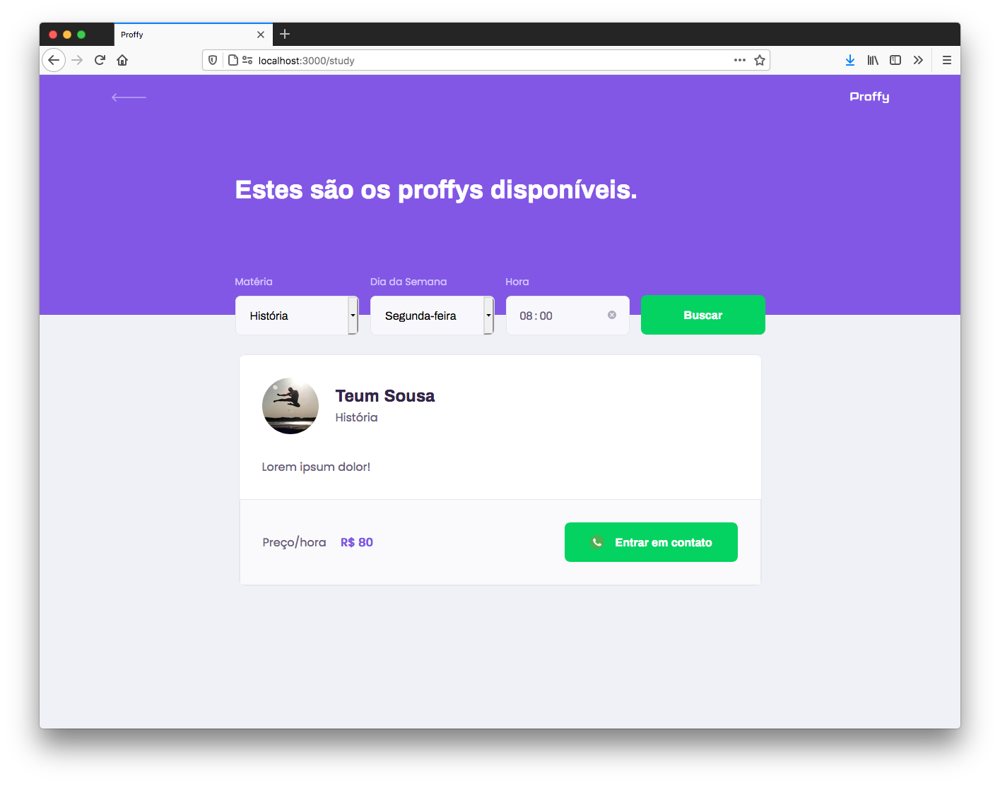

<p align="center">
    
</p>

# Frontend


_Tela inicial._


_Cadastro de professores._



Lista de professores disponíveis.\_

---

## Tecnologias utilizadas

Esta parte do projeto foi desenvolvida utilizando ReactJS.

---

## Para rodar a aplicação:

```shell
  $ yarn install
  $ yarn start
```

---

## Sobre o projeto

O **Proffy** é um projeto que visa ajudar professores e alunos a se conhecerem e marcarem aulas, de diversas matérias.
